# Flowball — Software Design Document

| | |
|---|---|
| **Project** | Flowball Free Kick Prototype |
| **Engine** | Godot 4.6 (Jolt Physics) |
| **Repository root** | `G:\Coding\flowball` |
| **Date** | 2026-06-27 |
| **Status** | In-development prototype |

---

## 1. Document Overview

### 1.1 Purpose

This document describes the software architecture, component design, data model, and runtime behavior of the Flowball free-kick prototype. It targets developers extending or maintaining the codebase.

### 1.2 Scope

Covers all GDScript source files under `scripts/`, the scene hierarchy of `scenes/sandbox/FreeKickSandbox.tscn` and its sub-scenes, project settings relevant to gameplay, and the input/shader pipeline.

### 1.3 References

| Document | Location |
|---|---|
| Design specification | `flowballpromptGODOT.md` |
| Biomechanical support-foot notes | `piedeapoyo.md` |
| Agent instructions | `AGENTS.md` |
| Project configuration | `project.godot` |

### 1.4 Conventions

- **Godot unit** = 1 meter
- All angles in degrees unless noted
- `&"StringName"` denotes Godot `StringName` constants

---

## 2. System Architecture

### 2.1 Context Diagram

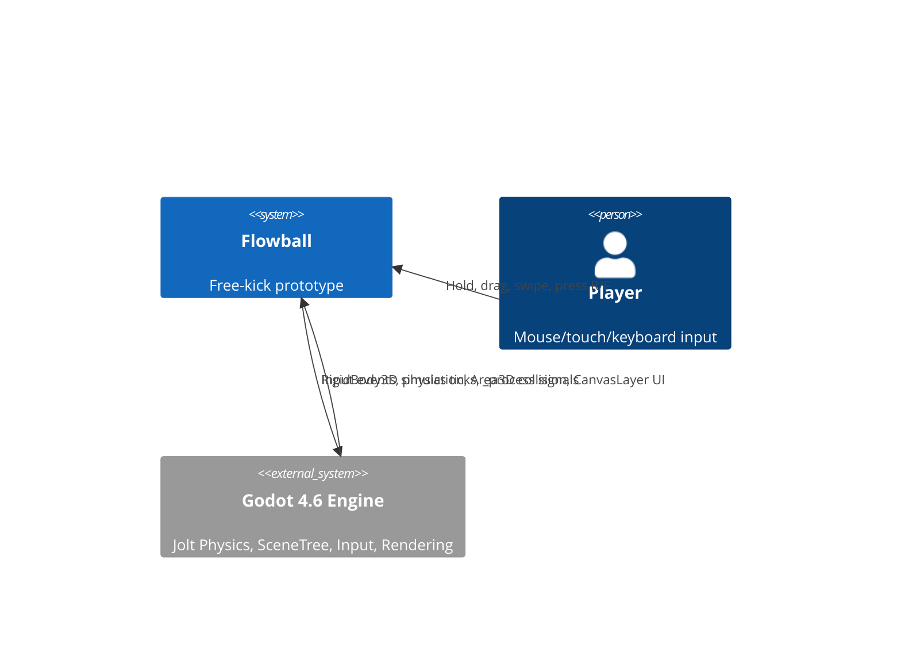

### 2.2 Layered Architecture

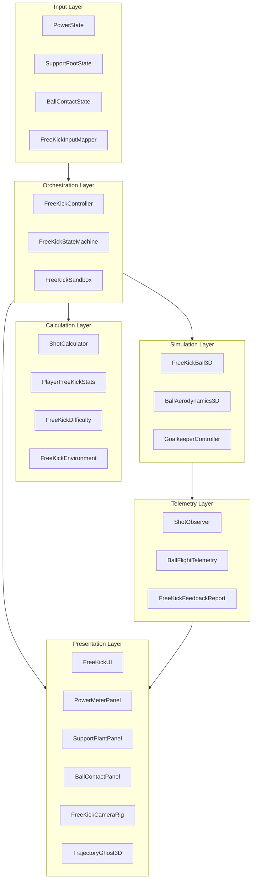

### 2.3 Scene Tree

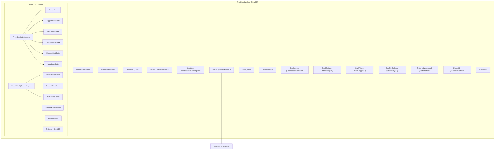

### 2.4 Data Flow

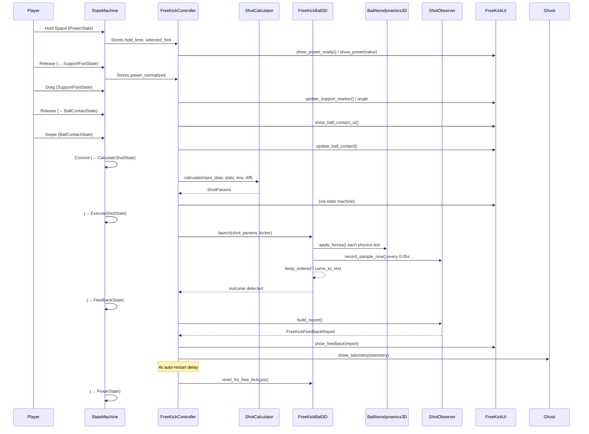

---

## 3. State Machine Design

### 3.1 State Diagram

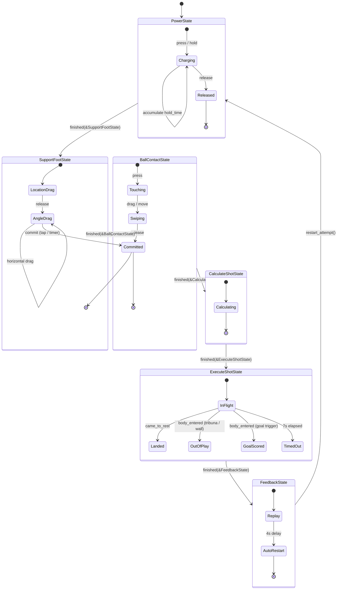

### 3.2 State Descriptions

#### PowerState — `scripts/state_machine/PowerState.gd`

| Aspect | Detail |
|---|---|
| **Entry** | Set camera `POWER_VIEW`, show power-ready UI |
| **Input** | `free_kick_power` action (Space / Mouse Left) + touch screen half detection |
| **Process** | Accumulates `hold_time`, calls `ShotCalculator.power_from_hold()` for saturating curve |
| **Exit trigger** | Release input → emit `finished(&"SupportFootState")` |
| **Foot selection** | Left screen half → "left" foot, right screen half → "right" foot |
| **Fallback** | No explicit `cancel_to_default`; must have press to proceed |

Power curve: `power = 1 - exp(-hold_time / 0.75)`.

#### SupportFootState — `scripts/state_machine/SupportFootState.gd`

| Aspect | Detail |
|---|---|
| **Entry** | Set camera `SUPPORT_TOP_DOWN`, show support panel |
| **Substep 1 — Location** | Drag in legal half of support zone (right-footed kicker → left half, x < 0). Uses `FreeKickInputMapper.clamp_to_support_foot_side()` |
| **Substep 2 — Angle** | Release ends location drag. Horizontal drag adjusts foot aim target (-1..1 → ±30°) |
| **Commit** | Auto-commit if `support_good_enough()` (35% radius, 0.12s); timer at 3s triggers default |
| **Output stored** | `support_vector, plant_depth, support_foot_angle, support_aim_target, support_quality, support_angle_quality` |
| **Quality model** | Distance bands from `piedeapoyo.md`: 0-15cm bad, 20-35cm optimal, 40-55cm risky, >55cm penalized |
| **Angle quality** | 0° straight (power), 10-25° open (curl), 25-45° more curl less control, closed inward penalized |

Implements `cancel_to_default()`: places marker at center with penalty flags.

#### BallContactState — `scripts/state_machine/BallContactState.gd`

| Aspect | Detail |
|---|---|
| **Entry** | Set camera `BALL_CONTACT_UI`, show ball contact overlay |
| **Touch down** | Records impact point (first touch), clamped to 1.0× ball radius |
| **Drag / swipe** | Collects follow-through points clamped to 1.8× radius |
| **Commit** | Release or timer (2.8s). Requires `contact_good_enough()`: ≥2 points, swipe ≥10% radius, ≥0.08s |
| **Normalization** | `FreeKickInputMapper.normalize_swipe_points()` produces normalized 2D coordinates |
| **Default** | Center impact (0,0), short straight downward swipe |
| **Output stored** | `impact_point, swipe_points, swipe_duration` |

#### CalculateShotState — `scripts/state_machine/CalculateShotState.gd`

Trivial pass-through state. On `enter()` calls `controller.calculate_shot()`, then immediately emits `finished(&"ExecuteShotState")`.

#### ExecuteShotState — `scripts/state_machine/ExecuteShotState.gd`

| Aspect | Detail |
|---|---|
| **Entry** | Set camera `SHOT_FOLLOW`, hide UI, start `ShotObserver` |
| **Launch** | After `fallback_contact_delay` (0.25s), calls `ball.launch(shot_params, kicker)` |
| **Outcome detection** | Connects to `ball.came_to_rest` and `ball.body_entered` |
| **Collision bodies** | `TribunaBackground`, `GoalCollision`, `Goalkeeper`, `GoalkeeperCollision`, `GoalNetCollision`, `WallDummy*` |
| **Outcomes** | `background_contact`, `keeper_contact`, `wall_contact`, `goal_frame_contact`, `landed`, `goal_scored` |
| **Safety** | Auto-timeout after `max_shot_duration` (7.0s) |
| **Exit** | Emit `finished(&"FeedbackState")` |

#### FeedbackState — `scripts/state_machine/FeedbackState.gd`

| Aspect | Detail |
|---|---|
| **Entry** | Set camera `FEEDBACK_REPLAY`, build report via `ShotObserver.build_report()` |
| **Ghost** | Calls `TrajectoryGhost3D.show_telemetry(telemetry)` |
| **UI** | Shows formatted feedback with coach tips |
| **Auto-restart** | After `AUTO_RESTART_DELAY_SECONDS` (4.0s), calls `controller.restart_attempt()` |
| **Signal** | Emits `free_kick_finished` on controller |

### 3.3 FreeKickController — `scripts/state_machine/FreeKickController.gd`

The central orchestrator. Owned by the sandbox scene as a child node.

**Exports:**
- `ball_path: NodePath` — resolves to `FreeKickBall3D`
- `kicker_path: NodePath` — resolves to kicker `CharacterBody3D` proxy
- `stats: PlayerFreeKickStats` — mutable stat block
- `difficulty: FreeKickDifficulty` — difficulty parameters
- `environment: FreeKickEnvironment` — environmental context

**Onready nodes:**
- `state_machine: FreeKickStateMachine`
- `ui: FreeKickUI`
- `camera_rig: FreeKickCameraRig`
- `shot_observer: ShotObserver`
- `trajectory_ghost: TrajectoryGhost3D`

**Key methods:**

| Method | Purpose |
|---|---|
| `_ready()` | Creates default resource instances if null, connects UI signals (`restart_requested`, `switch_foot_requested`, `next_spot_requested`), connects `state_machine.state_changed` |
| `set_free_kick_spot(label, ball_position, goal_position)` | Configure environment distance, angle, goal direction for this set piece |
| `start_free_kick(selected_foot)` | Reset input data, ball position, trajectory ghost. Emit `free_kick_started`. Start state machine |
| `calculate_shot()` | Calls `ShotCalculator.calculate(...)`, stores result, emits `shot_calculated(shot_params)` |
| `restart_attempt()` | Increments `run_id`, calls `start_free_kick()` again |

**Signal connections:**

| Emitter | Signal | Handler |
|---|---|---|
| `FreeKickUI` | `restart_requested` | `_on_restart_requested` |
| `FreeKickUI` | `switch_foot_requested` | `_on_switch_foot_requested` |
| `FreeKickUI` | `next_spot_requested` | `_on_next_spot_requested` |
| `FreeKickStateMachine` | `state_changed` | `_on_state_changed` |

### 3.4 FreeKickSandbox — `scripts/state_machine/FreeKickSandbox.gd`

Extends `Node3D`. The top-level game orchestrator managing set-piece progression, wall dummies, goalkeeper AI triggers, and score tracking.

**Key responsibilities:**
- Generates set pieces with progressive difficulty: distance 20-34m, lateral offset, wall count
- **Wall management:** Spawns capsule `CharacterBody3D` dummies spaced at 0.78m, positioned 9.15m from ball (FIFA regulation)
- **Wall jump:** On ball launch, probability-based jump reaction (0.35-0.9 depending on distance/angle) with random jump heights
- **Tracking:** `total_goals`, `total_attempts`, 3 attempts per set piece → game over
- **Goalkeeper trigger:** On `shot_calculated`, calls `_predict_target_at_goal()` then `keeper.react_to_shot()`

---

## 4. Shot Calculation System

### 4.1 Data Flow

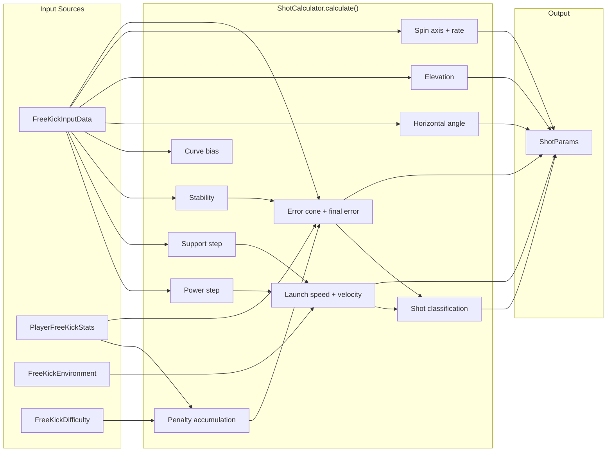

### 4.2 Calculation Step Details

#### Power

```
power = clamp(input.power, 0.0, 1.0)
```

#### Support Foot

```
support_vector      = input.support_vector         # -1..1
plant_depth         = input.plant_depth             # distance from ball center (meters)
support_foot_angle  = input.support_foot_angle      # degrees
support_aim_target  = input.support_aim_target      # -1..1
support_quality     = input.support_quality         # 0..1 (distance-based)
support_angle_quality = input.support_angle_quality # 0..1
```

#### Stat Normalization

```gdscript
# PlayerFreeKickStats.normalized(value)
# value / 100, clamped 0.01..1.0
# Applied to: kick_power, free_kick_accuracy, curve, technique, composure, weak_foot
```

#### Penalties

| Penalty | Condition | Effect |
|---|---|---|
| Weak foot | `selected_foot != preferred_foot` | `0.7 + 0.3 * weak_foot_stat` multiplier on technique |
| Timeout | `support_timer_expired` or `contact_timer_expired` | Per-missed-step penalty: `difficulty.default_penalty_scale * difficulty.composure_penalty_scale * (1 - composure)` |
| Overpower | `power > 0.85` | `(power - 0.85) * 30` degrees added to error cone |

#### Stability

```
stability = plant_depth * 0.15 + support_quality * 0.55 + support_angle_quality * 0.30
stability = clamp(stability, 0.35, 1.0)
```

Higher stability = tighter error cone, better technique transfer.

#### Curve Bias

```
curve_bias = support_aim_target * support_angle_quality * 0.12
curve_bias = clamp(curve_bias, -0.18, 0.18)
```

Positive = curl right (out-swing from support side), negative = curl left (in-swing).

#### Horizontal Angle

```gdscript
var horizontal_angle = -support_aim_target * 11.0   # degrees
# Foot angle fine-tunes aim within ±11° relative to base goal direction
```

Support aim target maps to a physical angle offset. The `-` sign means positive aim_target sends the ball left (from kicker's perspective).

#### Elevation

```
elevation = 10.0 + contact_y * 16.0 + upward_follow_through * 9.0
```

- `contact_y` = vertical component of normalized impact point (-1 high, +1 low)
- `upward_follow_through` = 0..1 measure of swipe going upward
- Lower on the ball (contact_y > 0) → more lift → higher trajectory
- Clamped to `[MAX_ELEVATION_DEG, MIN_ELEVATION_DEG]` = `[35°, -3°]`

#### Spin

**Spin axis (normalized Vector3):**
```
axis.x = contact_x * 0.5 + swipe_x * 0.5     # side spin (curl)
axis.y = contact_y * 0.6 - swipe_y * 0.3     # backspin / topspin
axis.z = 0.12 * foot_bias_sign               # small foot-angle bias
axis = axis.normalized()
```

**Spin rate (rad/s):**
```
lateral_action = abs(contact_x) + abs(swipe_x)
vertical_action = abs(contact_y) + abs(swipe_y * 0.5)
rate = (lateral_action + vertical_action * 0.4) * power * 70.0 * curve_stat
rate = clamp(rate, 0, MAX_SPIN_RATE)   # MAX_SPIN_RATE = 140
```

#### Error Cone

```gdscript
var base_error_cone = lerp(8.0, 1.0, accuracy)
var final_cone = base_error_cone / (technique * stability) + overpower_penalty + weak_foot_penalty + timeout_penalty
```

Range: roughly 0.5° (perfect technique + accuracy) to 40°+ (worst case).

**Final error (Vector2):**
```gdscript
var deterministic_seed = abs(input.impact_point.x * 7.3 + input.impact_point.y * 13.1 + swipe_duration * 3.7)
final_error = Vector2(
    sin(deterministic_seed) * error_cone * 0.35,
    cos(deterministic_seed * 1.7) * error_cone * 0.35
)
```

No RNG. Error is fully deterministic from input values.

#### Launch Velocity

```gdscript
# Speed
var launch_speed = lerp(14.0, 36.0, power) * power_stat * support_transfer + distance_bonus
launch_speed = clamp(launch_speed, MIN_LAUNCH_SPEED, MAX_LAUNCH_SPEED)   # 12..36 m/s

# Direction
var flat_dir = base_goal_direction.rotated(Vector3.UP, horizontal_angle + error.x)
var vertical_speed = launch_speed * sin(deg_to_rad(elevation + error.y))
var horizontal_speed = launch_speed * cos(deg_to_rad(elevation + error.y))
var velocity = flat_dir * horizontal_speed + Vector3.UP * vertical_speed
```

#### Shot Classification

| Type | Criteria |
|---|---|
| `knuckle_power` | `spin_rate < 18` and `power > 0.82` |
| `low_driven` | `elevation < 8` and swipe direction is downward |
| `curling_finesse` | `abs(spin_axis.x) > 0.55` and `spin_rate > 35` |
| `lifted` | `elevation > 22` |
| `balanced` | Everything else |

### 4.3 ShotCalculator — `scripts/calculation/ShotCalculator.gd`

- **Extends:** `RefCounted`
- **All methods static** — stateless, deterministic
- **`calculate(input, stats, environment, difficulty) -> ShotParams`** — main entry point
- **`power_from_hold(hold_time, charge_tau=0.75) -> float`** — saturating charge curve

### 4.4 Power Charge Curve

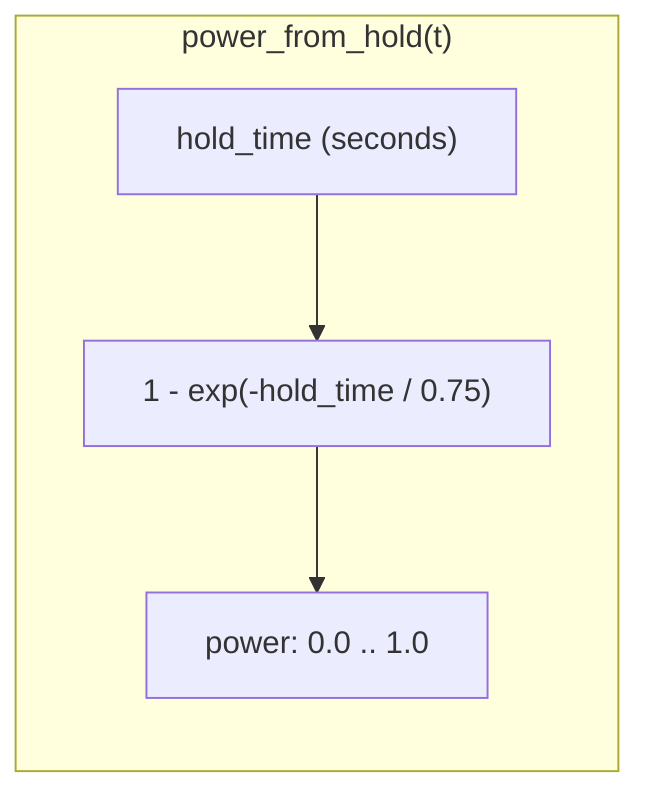

| Hold time | Power |
|---|---|
| 0.0s | 0.00 |
| 0.25s | 0.28 |
| 0.5s | 0.49 |
| 0.75s | 0.63 |
| 1.0s | 0.74 |
| 1.5s | 0.86 |
| 2.0s | 0.93 |
| 3.0s | 0.98 |

---

## 5. Ball Physics & Aerodynamics

### 5.1 FreeKickBall3D — `scripts/ball/FreeKickBall3D.gd`

- **Extends:** `RigidBody3D`
- **Mass:** 0.43 kg (set in `Ball3D.tscn`)
- **Collision shape:** Sphere, radius 0.11m
- **Physics material:** friction 0.35, bounce 0.58
- **Continuous CD:** enabled

**Lifecycle:**

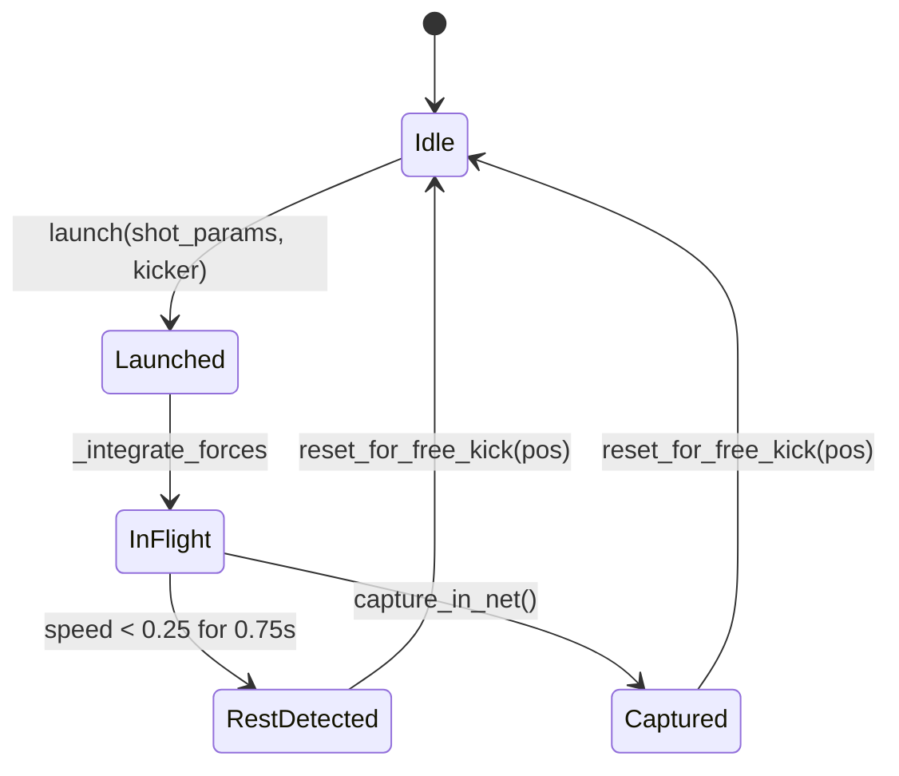

**Key methods:**

| Method | Signature | Behavior |
|---|---|---|
| `reset_for_free_kick` | `(position: Vector3)` | Freezes, zeros velocity, sets transform, deferred visibility |
| `launch` | `(shot_params: ShotParams, kicker: Node, ignore_seconds: float = 0.2)` | Unfreezes, sets linear/angular velocity from `ShotParams`, collision exception with kicker for 0.2s |
| `capture_in_net` | `(stop_delay: float = 0.18)` | After delay, zeros velocity, freezes, emits `came_to_rest` |
| `_integrate_forces` | `(state: PhysicsDirectBodyState3D)` | Delegates to `BallAerodynamics3D.apply_forces()`, detects rest condition |

**Signals:** `launched(shot_params)`, `came_to_rest`

### 5.2 BallAerodynamics3D — `scripts/physics/BallAerodynamics3D.gd`

- **Extends:** `Node` (child of the ball RigidBody3D)
- **Called from:** `FreeKickBall3D._integrate_forces()`

**Tuning exports:**

| Parameter | Default | Description |
|---|---|---|
| `aero_enabled` | `true` | Master toggle |
| `magnus_enabled` | `true` | Magnus force toggle |
| `wind_enabled` | `true` | Wind toggle |
| `air_density` | `1.225` | kg·m⁻³ |
| `ball_radius` | `0.11` | m |
| `drag_coefficient` | `0.25` | Cd |
| `drag_multiplier` | `1.0` | Tuning scalar |
| `magnus_multiplier` | `0.45` | Tuning scalar (raised for readability on short free-kick range) |
| `spin_decay_per_second` | `0.35` | 35% angular velocity loss per second |
| `wind_multiplier` | `1.0` | Tuning scalar |

**Force equations (applied in `apply_forces(state)`):**

```
relative_v = ball_linear_velocity - wind_vector
v_mag = |relative_v|
drag_force = -0.5 * rho * v_mag^2 * Cd * A * drag_multiplier
             (direction = -relative_v.normalized())

magnus_force = (angular_v x relative_v) * rho * A * r * magnus_multiplier

total_force = drag_force + magnus_force ( + wind_force if separate )

state.linear_velocity += (total_force / mass) * step
state.angular_velocity *= (1 - spin_decay_per_second * step)
```

Where:
- `A = π * r²` (cross-sectional area)
- `rho` = air density
- `step` = physics tick delta

### 5.3 Physics Constants Summary

| Quantity | Value | Unit |
|---|---|---|
| Ball mass | 0.43 | kg |
| Ball radius | 0.11 | m |
| Gravity | 9.8 | m·s⁻² |
| Min launch speed | 12.0 | m·s⁻¹ |
| Max launch speed | 36.0 | m·s⁻¹ |
| Min elevation | -3.0 | deg |
| Max elevation | 35.0 | deg |
| Max spin rate | 140.0 | rad·s⁻¹ |
| Max horizontal offset | 25.0 | deg |
| Ideal power max | 0.85 | — |
| Air density | 1.225 | kg·m⁻³ |
| Drag coefficient | 0.25 | — |
| Magnus multiplier | 0.45 | — |
| Spin decay | 0.35 | s⁻¹ |
| Rest speed threshold | 0.25 | m·s⁻¹ |
| Rest time required | 0.75 | s |

---

## 6. UI System

### 6.1 Panel Hierarchy

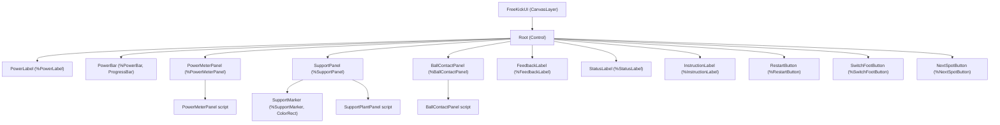

### 6.2 FreeKickUI — `scripts/ui/FreeKickUI.gd`

- **Extends:** `CanvasLayer`
- **Signals:** `restart_requested`, `switch_foot_requested`, `next_spot_requested`

**Inner class:** `ModernScoreHud` (extends `Control`) — custom-drawn scoreboard with:
- Set piece number (1-5)
- Conversion rate (%)
- Misses tracker (X marks)
- Step stepper indicator

**Alignment methods:**

| Method | Purpose |
|---|---|
| `align_support_marker_hint()` | Projects ball world position to screen coordinates for support zone placement |
| `align_ball_contact_overlay()` | Sizes ball panel to match rendered ball size on screen |
| `align_power_meter_to_ball()` | Positions power meter control next to ball screen position |

**Formatting:** `_format_feedback_report(report: FreeKickFeedbackReport) -> String` produces a human-readable multi-line string with shot type, speed, curl direction, elevation, support feedback, and coach tip.

### 6.3 PowerMeterPanel — `scripts/ui/PowerMeterPanel.gd`

- **Extends:** `Control`
- **Exports:** `kicking_foot`, `power_value` (0.0-1.0)
- **Custom drawing:** Vertical bar with color-coded zones:

| Zone | Range | Color |
|---|---|---|
| LOW | 0-40% | Gray/blue |
| CONTROL | 40-70% | Green |
| IDEAL | 70-85% | Gold |
| RISK | 85-100% | Red |

Also draws: boot texture, percentage label, zone markers.

### 6.4 SupportPlantPanel — `scripts/ui/SupportPlantPanel.gd`

- **Extends:** `Panel`
- **Exports:** `selected_foot`, `sector_radius` (160), `sector_angle_degrees` (120)
- **Custom drawing (top-down view):**
  - Pitch grid background
  - Legal vs. illegal zone shading (right-footed → left half legal)
  - Distance rings: optimal (20-35cm) / risky (40-55cm) / danger (>55cm)
  - Aim lanes toward left post, center, right post
  - Ball at center
  - Support marker with boot icon
  - Angle meter in substep 2

### 6.5 BallContactPanel — `scripts/ui/BallContactPanel.gd`

- **Extends:** `Panel`
- **Exports:** `ball_radius_px` (180)
- **Custom drawing:**
  - Ball target circle
  - High/low contact zones (drive/topspin vs. lift/backspin)
  - Left/right curl labels
  - Swipe trail visualization (points collected during drag)
  - Curl meter

---

## 7. Camera System

### 7.1 FreeKickCameraRig — `scripts/camera/FreeKickCameraRig.gd`

- **Extends:** `Node3D`
- **Signals:** `mode_changed(mode: StringName)`
- **Exports:**
  - `camera_path: NodePath` — resolves to `Camera3D`
  - `target_path: NodePath` — the ball or look-at target
  - `goal_position: Vector3` — goal center for dynamic targeting
  - `blend_time: float` = 0.35s (tween duration)

### 7.2 Camera Modes

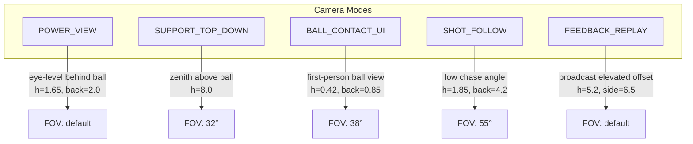

**Blending:** Each mode stores a camera transform (position relative to ball/target) and FOV. `set_mode(next_mode)` tweens both simultaneously with cubic `ease_out` curve over `blend_time` (0.35s).

**Dynamic goal centering:** Some modes have dual transforms — one relative to ball, one relative to goal — and interpolate based on context.

---

## 8. Input System

### 8.1 FreeKickInputMapper — `scripts/input/FreeKickInputMapper.gd`

- **Extends:** `RefCounted`
- **All methods static** — stateless utilities

| Method | Purpose |
|---|---|
| `clamp_to_support_sector(local_pos, radius, foot, sector_angle=120)` | Legacy sector clamp |
| `clamp_to_support_foot_side(local_pos, radius, foot)` | Right-foot kicker plants left of ball (x < 0). Left-foot reverses. Minimum side distance 18% of radius |
| `clamp_to_goal_aim_lane(local_pos, radius)` | Legacy helper |
| `support_vector_from_marker(marker_pos, radius)` | Normalizes marker position to -1..1 range |
| `support_good_enough(marker_pos, radius, elapsed, threshold)` | Auto-commit test: 35% radius, 0.12s minimum |
| `screen_to_control_local(screen_pos, control)` | Convert screen coordinates to control-local coordinates |
| `normalize_ball_contact(local_pos, ball_radius_px)` | Normalizes contact position to ball radius |
| `normalize_swipe_points(points, ball_radius_px)` | Normalizes all points; first clamped to 1.0× radius, rest to 1.8× |
| `contact_good_enough(points, duration, ball_radius_px, threshold)` | Validation: ≥2 points, swipe ≥10% radius, ≥0.08s |

### 8.2 Per-State Input Handling

| State | Event type | Handling |
|---|---|---|
| `PowerState` | `InputEventAction` (`free_kick_power`) + `InputEventMouseButton`/`ScreenTouch` | Action press → start charge. Release → commit. Screen X position determines foot (left/right half) |
| `SupportFootState` | `InputEventMouseButton` + `InputEventMouseMotion` / `ScreenTouch` + `ScreenDrag` | Button down → start location drag. Motion → drag marker (clamped). Button up → lock location, enter angle substep. Motion in angle mode → adjust aim angle |
| `BallContactState` | `InputEventMouseButton` + `InputEventMouseMotion` / `ScreenTouch` + `ScreenDrag` | Button down → record impact point. Motion → collect swipe points. Button up → commit |

### 8.3 Input Map (from `project.godot`)

| Action | Primary | Secondary | Tertiary |
|---|---|---|---|
| `free_kick_power` | Space | Mouse Left | Touch tap |
| `free_kick_restart` | R | Mouse Right | — |
| `free_kick_switch_foot` | F | Mouse Middle | — |

---

## 9. Resources & Data Model

### 9.1 Class Diagram

```mermaid
classDiagram
    class FreeKickInputData {
        +float hold_time
        +float power_normalized
        +String selected_foot
        +Vector2 support_touch_pos
        +Vector2 support_vector
        +float plant_depth
        +float support_foot_angle
        +float support_aim_target
        +float support_quality
        +float support_angle_quality
        +bool support_timer_expired
        +bool used_default_support
        +Vector2 impact_point
        +Array swipe_points
        +float swipe_duration
        +bool contact_timer_expired
        +bool used_default_contact
        +void reset()
    }

    class ShotParams {
        +float power
        +Vector3 launch_velocity
        +Vector3 spin_axis
        +float spin_rate
        +float elevation_angle
        +float horizontal_angle
        +Vector2 contact_point
        +Vector2 support_vector
        +float plant_depth
        +float support_foot_angle
        +float support_aim_target
        +float stability
        +float curve_bias
        +float error_cone_degrees
        +Vector2 final_error
        +StringName shot_type
    }

    class PlayerFreeKickStats {
        +int kick_power
        +int free_kick_accuracy
        +int curve
        +int technique
        +int composure
        +int weak_foot
        +String preferred_foot
        +float normalized(value)
    }

    class FreeKickDifficulty {
        +float step2_time_limit
        +float step3_time_limit
        +float sector_size_multiplier
        +int guidance_level
        +float default_penalty_scale
        +float composure_penalty_scale
        +float input_smoothing_assist
        +float auto_commit_threshold_multiplier
    }

    class FreeKickEnvironment {
        +Vector3 wind_vector
        +float distance_to_goal
        +float angle_to_goal
        +int wall_player_count
        +int goalkeeper_rating
        +float pressure_context
        +Vector3 base_goal_direction
    }

    class BallFlightTelemetry {
        +float sample_interval
        +PackedVector3Array positions
        +PackedVector3Array velocities
        +float peak_height
        +float max_lateral_deviation
        +float total_flight_time
        +String final_outcome
        +void add_sample(position, velocity)
    }

    class FreeKickFeedbackReport {
        +String summary
        +String outcome
        +String shot_type
        +float power
        +float spin_rate
        +String curl_direction
        +float curl_strength
        +float elevation_angle
        +float horizontal_angle
        +String support_feedback
        +String coach_tip
        +float peak_height
        +float total_flight_time
    }

    ShotCalculator ..> FreeKickInputData : reads
    ShotCalculator ..> PlayerFreeKickStats : reads
    ShotCalculator ..> FreeKickDifficulty : reads
    ShotCalculator ..> FreeKickEnvironment : reads
    ShotCalculator ..> ShotParams : creates

    ShotObserver ..> BallFlightTelemetry : builds
    ShotObserver ..> FreeKickFeedbackReport : builds

    FreeKickController --> FreeKickInputData : owns
    FreeKickController --> ShotParams : owns
    FreeKickController --> PlayerFreeKickStats : exports
    FreeKickController --> FreeKickDifficulty : exports
    FreeKickController --> FreeKickEnvironment : exports
```

### 9.2 Resource File Locations

| Class | File |
|---|---|
| `FreeKickInputData` | `scripts/resources/FreeKickInputData.gd` |
| `ShotParams` | `scripts/resources/ShotParams.gd` |
| `PlayerFreeKickStats` | `scripts/resources/PlayerFreeKickStats.gd` |
| `FreeKickDifficulty` | `scripts/resources/FreeKickDifficulty.gd` |
| `FreeKickEnvironment` | `scripts/resources/FreeKickEnvironment.gd` |
| `BallFlightTelemetry` | `scripts/telemetry/BallFlightTelemetry.gd` |
| `FreeKickFeedbackReport` | `scripts/telemetry/FreeKickFeedbackReport.gd` |

All extend `Resource` and use `class_name` for type resolution. None are pre-created as `.tres` files; defaults are constructed in `FreeKickController._ready()`.

---

## 10. Telemetry & Feedback

### 10.1 ShotObserver — `scripts/telemetry/ShotObserver.gd`

- **Extends:** `Node`
- **Exports:** `sample_interval` (0.05s = 20 Hz)

**Lifecycle:**

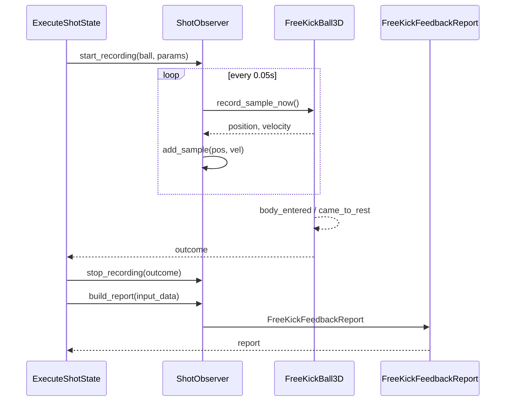

**`build_report(input_data) -> FreeKickFeedbackReport`:**
- Computes `peak_height` (max Y in telemetry positions)
- Computes `max_lateral_deviation` (max horizontal distance from start→goal line)
- Determines `curl_direction` / `curl_strength` from telemetry lateral deviation
- Formats `coach_tip` based on outcome + input patterns (e.g., "Overpowered — try releasing earlier")

### 10.2 BallFlightTelemetry — `scripts/telemetry/BallFlightTelemetry.gd`

Stores per-sample data in `PackedVector3Array` for memory efficiency. Used exclusively by `ShotObserver` and `TrajectoryGhost3D`.

### 10.3 FreeKickFeedbackReport — `scripts/telemetry/FreeKickFeedbackReport.gd`

Human-readable report. Fields populated by `ShotObserver.build_report()`.

### 10.4 TrajectoryGhost3D — `scripts/telemetry/TrajectoryGhost3D.gd`

- **Extends:** `MeshInstance3D`
- **Exports:** `ghost_color` (cyan), `point_scale`
- **Rendering:** Uses `ImmediateMesh` to draw a line strip through all telemetry positions
- **Lifecycle:** `clear()` on reset, `show_telemetry(telemetry)` in feedback phase

---

## 11. Actor System

### 11.1 GoalkeeperController — `scripts/actors/GoalkeeperController.gd`

- **Extends:** `CharacterBody3D`
- **Collision:** Capsule (r=0.34, h=1.55)

**Exports:**

| Parameter | Default | Description |
|---|---|---|
| `reaction_delay_seconds` | 0.45 | Delay before reacting to shot |
| `dive_offset` | 1.25 | Lateral dive distance (m) |
| `dive_up_offset` | 0.65 | Vertical dive distance (m) |
| `recover_seconds` | 0.45 | Time to return to ready after stop |

**Methods:**

| Method | Behavior |
|---|---|
| `reset_for_free_kick()` | Returns to home position (goal line center) |
| `set_ready()` | Plays `gk_ready` animation, starts procedural idle sway |
| `react_to_shot(shot_params, predicted_target)` | Delays by `reaction_delay_seconds`, then tween-dives to predicted zone + plays save animation |
| `classify_target(predicted_target)` | Returns `"up"`, `"left"`, `"right"`, or `"center"` based on goal-plane position |
| `play_save_animation(zone)` | Plays `gk_dive_left` / `gk_dive_right` / `gk_dive_up` / `gk_ready` |
| `play_goal_conceded_reaction()` | Plays `gk_concede` |

**Procedural idle (`_update_idle_pose`):** Modifies `Skeleton3D` bone rotations for spine, arms, legs, and knees using sine-based breathing and swaying. AnimationPlayer library is currently placeholder (missing actual animation assets — fallback to procedural pose).

**Collision zones:**
- `GoalkeeperCollision` (StaticBody3D child) — detected by `ExecuteShotState` as `keeper_contact` outcome
- `SaveReachArea` (Area3D child, Box 3.2×2.1×0.65m) — extended save reach

**Reaction flow:**

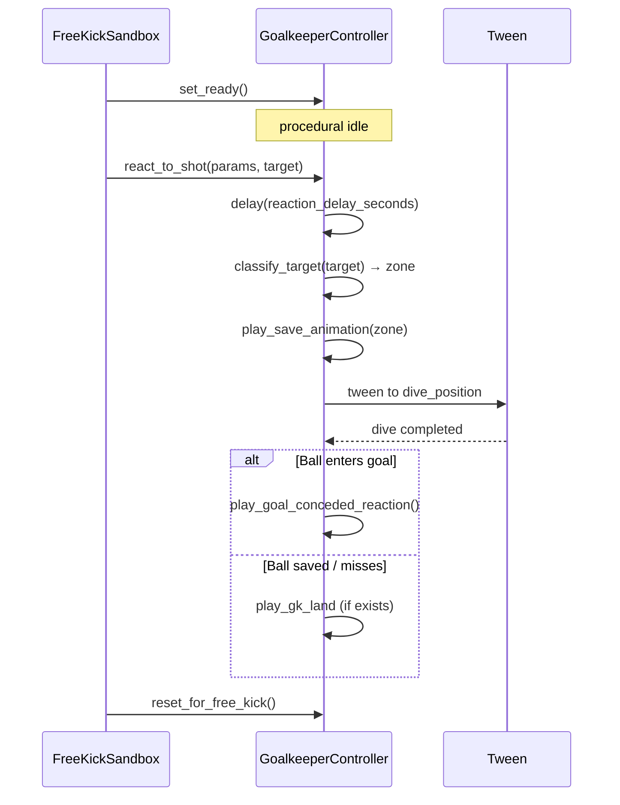

---

## 12. Sandbox & Support Systems

### 12.1 FreeKickSandbox — `scripts/state_machine/FreeKickSandbox.gd`

The top-level `Node3D` managing game-mode context.

**Set-piece generation:**
- 5 set pieces per session
- Distance: 20m → 34m (progressive)
- Lateral offset: varies by set piece index
- Wall count: varies (more players at longer distances)
- 3 attempts per set piece → game over

**Wall dummies:**
- Capsule `CharacterBody3D` dummies spaced at 0.78m intervals
- Positioned 9.15m from ball along ball→goal line (FIFA regulation)
- On shot: probabilistic jump reaction (`randf() < wall_jump_probability`), jump height `randf() * max_jump_height`

**Scoring:**
- `total_goals`, `total_attempts` tracked across session
- `set_piece_number` (0-4), `current_set_piece` data
- `game_over` flag after 3 misses on a single set piece

**Goalkeeper prediction:** `_predict_target_at_goal()` — simple linear projection of `ShotParams.launch_velocity` to goal plane (y=0 at goal line), accounting for gravity. Provides `predicted_target: Vector2` in goal-plane coordinates.

### 12.2 GoalTrigger3D — `scripts/sandbox/GoalTrigger3D.gd`

- **Extends:** `Area3D`
- **Signals:** `goal_scored`
- **Behavior:** On `body_entered` with `FreeKickBall3D`, calls `ball.capture_in_net()` (scales velocity, reduces spin, freezes after delay)
- Connected to `FreeKickSandbox._on_goal_scored`

### 12.3 GoalNetVisual3D — `scripts/sandbox/GoalNetVisual3D.gd`

- **Extends:** `Node3D`
- Builds procedural net from cylinder mesh segments
- Reacts to ball impact with displacement weighted by distance from impact point

### 12.4 FootballFieldMarkings3D — `scripts/sandbox/FootballFieldMarkings3D.gd`

- **Extends:** `Node3D`
- Generates FIFA-standard international pitch markings (105×68m)
- Uses `BoxMesh` instances for: halfway line, touchlines, goal lines, penalty areas (16.5×40.3m), goal areas (5.5×18.3m), penalty mark (11m), center spot, center circle (9.15m radius), corner arcs

---

## 13. Testing Strategy

### 13.1 Smoke Test — `scripts/tests/ShotCalculatorSmokeTest.gd`

- **Extends:** `SceneTree` (runs in `_init()`)
- **Execution:** `godot --headless --script scripts/tests/ShotCalculatorSmokeTest.gd`
- **Exit code:** 0 = all pass, 1 = any fail

**Test cases:**

| # | Name | What it verifies |
|---|---|---|
| 1 | `test_same_input_repeatable` | Identical inputs produce identical `ShotParams` (determinism) |
| 2 | `test_overpower_increases_error_cone` | Power > 0.85 adds penalty to error cone |
| 3 | `test_timer_defaults_add_penalty` | `used_default_support` / `used_default_contact` flags add timeout penalty |
| 4 | `test_lower_contact_lifts_ball` | Higher `contact_y` → higher elevation angle |
| 5 | `test_center_contact_straighter_than_side` | Center contact (x=0) produces smaller horizontal angle offset than side contact |
| 6 | `test_side_swipe_curve` | Strong side swipe → high side-spin component |
| 7 | `test_right_half_contact_left_support_curls_left` | Right-half contact + left support → negative curve_bias |
| 8 | `test_right_half_contact_right_support_curls_left` | Both right-side → still negative curve_bias |
| 9 | `test_support_aim_target_adjusts_horizontal` | Non-zero aim_target → non-zero horizontal_angle |
| 10 | `test_support_aim_target_reaches_goal_sides` | Extreme aim_target values cover both posts |
| 11 | `test_spot_angle_not_double_counted` | Horizontal offset is exactly 11° per unit of aim_target |
| 12 | `test_follow_through_increases_spin` | Longer swipe → higher spin rate |
| 13 | `test_support_location_not_direct_aim` | Support position alone does not set horizontal aim (only foot angle) |
| 14 | `test_support_foot_side_is_physical` | Right-foot marker x < 0, left-foot marker x > 0 |

### 13.2 Determinism Guarantee

`ShotCalculator` uses no RNG. The "random" error is computed deterministically:

```gdscript
var seed = abs(input.impact_point.x * 7.3 + input.impact_point.y * 13.1 + swipe_duration * 3.7)
final_error = Vector2(sin(seed), cos(seed * 1.7))
```

This means identical player input always produces identical shot output. The design spec notes that future seeded-random may be added for variety modes, but only with explicit `seed` parameter (replay-friendly).

---

## 14. Outcome Detection & Collision Model

### 14.1 Collision Bodies

| Body name | Type | Detected outcome |
|---|---|---|
| `TribunaBackground` (and Left/Right) | `StaticBody3D` | `background_contact` |
| `GoalCollision` | `StaticBody3D` | `goal_frame_contact` |
| `Goalkeeper` | `CharacterBody3D` | `keeper_contact` |
| `GoalkeeperCollision` | `StaticBody3D` | `keeper_contact` |
| `GoalNetCollision` | `StaticBody3D` | `net_contact` |
| `WallDummy*` | `CharacterBody3D` | `wall_contact` |
| `GoalTrigger` | `Area3D` | `goal_scored` (signal, not collision) |
| Ground / pitch | `StaticBody3D` | `landed` (via `came_to_rest`) |

### 14.2 ExecuteShotState Outcome Flow

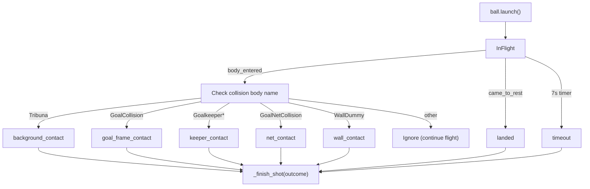

---

## 15. Scene References

### 15.1 FreeKickSandbox.tscn (main scene)

The only scene configured as "main" in `project.godot`. Contains:

- Environment: `WorldEnvironment`, `DirectionalLight3D`, 6 stadium lights
- Pitch: `TestPitch` (StaticBody3D) with mesh + collision, `FieldLines` (FootballFieldMarkings3D)
- Goal: Static mesh from `goal.glb`, `GoalCollision`, `GoalTrigger` (Area3D), `GoalNetCollision`, `GoalNetVisual`
- Goalkeeper: from `Goalkeeper.tscn`, positioned on goal line
- Ball: from `Ball3D.tscn`, positioned at free-kick spot
- Kicker: hidden `CharacterBody3D` proxy
- Camera: `Camera3D` node targeted by `FreeKickCameraRig`
- Controller: from `FreeKickController.tscn`

### 15.2 FreeKickController.tscn (sub-scene)

Reusable controller scene containing:
- `FreeKickStateMachine` with all 6 child states
- `FreeKickUI` CanvasLayer
- `FreeKickCameraRig`
- `ShotObserver`
- `TrajectoryGhost3D`

### 15.3 Ball3D.tscn (sub-scene)

- `RigidBody3D` (mass 0.43, continuous CD, custom physics material)
- `CollisionShape3D` (sphere r=0.11)
- `SoccerBallVisual` (MeshInstance3D from `soccer_ball.glb`)
- `BallAerodynamics3D` child node

### 15.4 Goalkeeper.tscn (sub-scene)

- `CharacterBody3D` + capsule collision (r=0.34, h=1.55)
- `ImportedGoalkeeper` (from `goalkeeper_rigged.glb`)
- `AnimationPlayer` (currently placeholder library)
- `GoalkeeperCollision` (StaticBody3D child)
- `SaveReachArea` (Area3D, Box 3.2×2.1×0.65m)

---

## 16. Future Roadmap

### 16.1 Known Gaps (Current State)

- **Animation assets:** Goalkeeper `AnimationPlayer` uses placeholder animation names. Actual `.glb` animations (dive, save, recover, concede) need to be imported or created
- **Wall jump tuning:** Jump probabilities and heights are basic `randf()` — not yet informed by real wall behavior data
- **Goalkeeper AI:** `_predict_target_at_goal()` is a simple gravity-only projection. No考虑了 spin or aerodynamic curve in prediction
- **UI polish:** `ModernScoreHud` custom drawing is functional but minimal. Touch/tap area sizing may need device-specific adjustment
- **Sound:** No audio system implemented
- **Replay system:** No dedicated replay or highlight capture
- **Shader:** `shaders/` directory exists but is empty — no visual-effect shaders yet
- **Input RAW folder:** `assets/Inputs RAW/` present but unused in code

### 16.2 Potential Expansions

| Area | Description |
|---|---|
| **Match context** | Embed free-kick system in a larger match simulation with possession, fouls, and team management |
| **Training mode** | Repeatable practice with visual guides, trajectory prediction overlay, and progress tracking |
| **Replay system** | Full 3D replay with camera controls, speed control, and bookmarking key moments |
| **Multiplayer** | Local or networked free-kick competition with shared set pieces |
| **Shot variety** | Add chip shots, driven shots, knuckleballs with distinct mechanics beyond classification labels |
| **Stat progression** | Player leveling / stat distribution that feeds into `PlayerFreeKickStats` |
| **Dynamic difficulty** | Adaptive `FreeKickDifficulty` based on player success rate |

### 16.3 Tuning Targets

| System | Current approach | Desired outcome |
|---|---|---|
| Aerodynamics | Magnus multiplier at 0.45 for readability | Tune to match real free-kick curve radii (2-5m lateral deviation at 24m) |
| Power curve | `tau = 0.75` fixed | Potentially expose per-kicker or per-difficulty |
| Error cone | Linear stat scaling | Non-linear falloff for extreme stats (very low accuracy much worse, very high accuracy much better) |
| Difficulty | Time limits + penalty scales per difficulty | More fine-grained profiles (Easy / Medium / Hard / Legendary) |
| Goalkeeper reaction | Static 0.45s delay | Reaction time scaled by keeper rating + distance + shot power |

### 16.4 Performance Considerations

- `TrajectoryGhost3D` uses `ImmediateMesh` — fine for a single ghost but not for multiple
- `ShotObserver` records at 20 Hz for ~7s = ~140 samples; `PackedVector3Array` is efficient
- Procedural net visual uses cylinder mesh segments — may need LOD for larger scenes
- Pitch markings box meshes are static after generation — no runtime cost

---

*End of Document*

---

**Revision History**

| Date | Author | Changes |
|---|---|---|
| 2026-06-27 | opencode | Initial comprehensive SDD |
