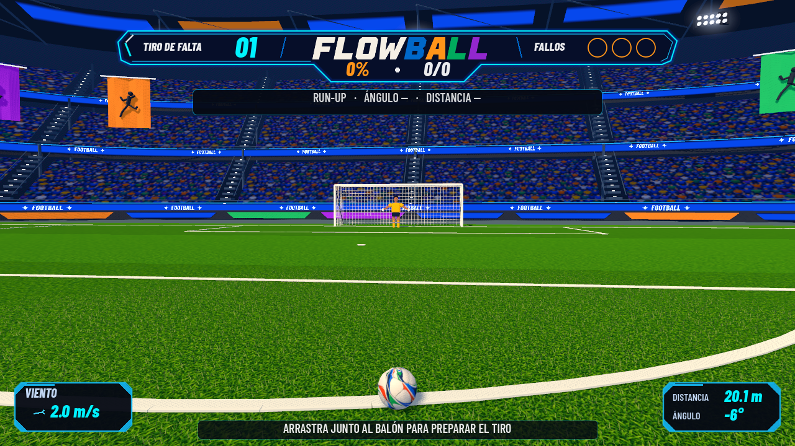
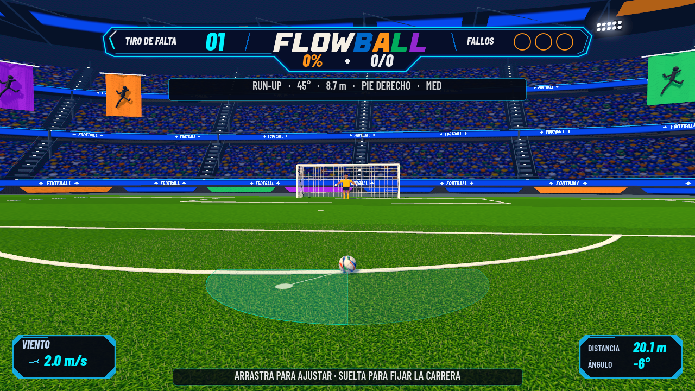

# Preparation screen — in-engine art delivery

The sandbox now uses the new stadium, textured round ball, broadcast HUD and near-level preparation camera. Run `scenes/sandbox/FreeKickSandbox.tscn` in Godot 4.7.2. All screenshots below are viewport captures from the running game.



## Stadium clearance and run-up correction

The original oval intersected the rectangular pitch corners. The stadium now uses a rounded rectangular perimeter, with its shape shared by Blender and Godot in `assets/models/preparation/layout.json`. A dark runoff apron separates the grass from the stands. The imported low stadium geometry has a measured minimum clearance of approximately 4.11 m from the 68 × 105 m playing-field rectangle.

Run-up feedback now appears before power: placeholder guidance on entry, then live angle, distance and kicking foot during the drag. The ground sector is drawn at 0.095 m, above the visual turf and blades; it was previously buried at 0.03 m. Releasing the gesture still commits the existing values and starts power without changing input mapping or shot equations.



[Top-down clearance evidence](deliverables/preparation/stadium_clearance.png)

`PreparationRegressionSmokeTest.gd` passes: imported geometry clearance, visible feedback for both feet, live values, marker height, and unchanged commit-to-power transition. `ArcadeFlowSmokeTest.gd` also passes after this correction. The Blender stadium source and GLB have been regenerated; the ball source is unchanged.

## Editable assets

Boot UI correction: power and support now share `assets/ui/tv_arcade/boot_clean.png`, an RGBA edit made with the built-in image-generation tool to remove the white slabs around the original Blender render. The source and exact edit prompt are preserved in `boot_clean.prompt.txt`. `HudTheme.BOOT_FORWARD_ROTATION` normalizes its downward-facing source to screen-up before mirroring or support rotation. Both kicking feet and their opposite support feet were visually checked in Godot; screenshots are under `docs/deliverables/boot/`. No input or shot formula changed.

| Asset | Source | Runtime export |
| --- | --- | --- |
| Three-tier stadium, curved terraces, aisles, roof, lights and flags | `art/blender/preparation/stadium.blend` | `assets/models/preparation/stadium.glb` |
| Smooth 0.11 m radius match ball | `art/blender/preparation/ball.blend` | `assets/models/preparation/ball.glb` |
| Grass, simplified crowd and ball albedos | `assets/textures/preparation/*.png` | Packed into Blender/GLB; turf is also sampled by the Godot shader |
| Angular multicolor wordmark | `assets/ui/tv_arcade/flowball.svg` | Vector texture in `ArcadeScoreHud.gd` |

The textures were created with the built-in image-generation tool. The crowd was revised at the user's request: blurred silhouettes and color patches replace detailed faces. Prompts and provenance are in `assets/textures/preparation/PROMPTS.md`.

The stadium is actual curved geometry with separate surfaces and depth. Textures are mapped onto those surfaces; the concept image is not a background. Blender files contain packed images. Godot material overrides live in `TVArcadeArt.gd` and `assets/shaders/preparation_*.gdshader`, so re-exporting the GLBs does not erase the runtime treatment.

## Visual and integration changes

- Preparation camera: 60° vertical FOV, 1 m above the ball and 2.1 m behind it before run-up pullback. The ball stays near the bottom of the frame and the goal near its center.
- Compact cyan broadcast frame: set piece, FLOWBALL, percentage and goals/attempts, three misses. No duplicated logo or top phase bars.
- Curved LED bands, stepped aisles, folded colored flags, roof trusses and soft lamp halos enclose the shot.
- Turf uses anisotropic mip filtering, mowing variation and a deterministic instanced foreground grass patch. The patch follows new attempts and excludes the nearby penalty markings.
- Four-sample MSAA keeps the net and roof diagonals legible. This is set at runtime, without changing project settings in this delivery.
- Wind and distance panels use the same chamfered frame and condensed italic display typography. Preparation guidance is centered below the ball.
- Existing controllers, physics bodies, collisions, shot equations, result actions and progression remain authoritative.

## Reproduce

From the repository root, with the executables on PATH:

```powershell
blender --background --factory-startup --python tools/blender/build_preparation.py
godot --headless --path . --editor --import --quit
godot --path . --rendering-method mobile --resolution 1280x720 --script scripts/tests/PreparationVisualCapture.gd
```

The capture script writes to `build/preparation_delivery/`, uses a separate temporary progress file and leaves the player's saved progression alone. Review copies are in `docs/deliverables/preparation/`. The approved concept is included there as `approved_concept.png` for comparison.

## Verification

Godot 4.7.2, Forward Mobile renderer, desktop GTX 1070:

| Check | Result |
| --- | --- |
| Preparation render, 1280 × 720 | Captured and visually inspected |
| Preparation, left foot, 1560 × 720 | Captured and visually inspected |
| Full five-view capture plus feedback, Restart and selector | Completed; no script/shader errors |
| Keeper animation | `gk_ready`, 12 tracks |
| `ArcadeFlowSmokeTest.gd` | PASS |
| `FreeKickUIStatsSmokeTest.gd` | PASS |
| `FreeKickUIScaleSmokeTest.gd` | PASS |
| `ShotCalculatorSmokeTest.gd` | 57 pass; 1 pre-existing knuckle calibration failure |

The knuckle case reports RMS 0.65 m and maximum 2.20 m, outside its expected calibration band. Calculation, physics and that test are unchanged from Git HEAD. Headless commands also report a Windows certificate-store access warning in the restricted environment; it does not prevent the local tests from running.

Preparation sampled approximately 100 FPS and 139 draw calls. The later wall scenario in the full capture sampled 37 FPS and 337 draw calls. These are point samples, not a sustained benchmark. **A consistent 60 FPS across the whole game, iPhone performance and iOS export are not validated.** Characters and the power boot still use the prior art kit; this delivery concentrates on the preparation screen.

## Review and rollback boundary

This visual delivery is included in v2.0.0. It includes the new preparation assets and builder, preparation shaders, `TVArcadeArt.gd`, the camera framing changes, `ArcadeScoreHud.gd`, the relevant `FreeKickUI.gd`/`HudTheme.gd` layout changes, capture script and this evidence. Removing this slice should restore the prior visual adapter and camera/HUD treatment while retaining the earlier result/progression implementation and unrelated local work. Do not reset the whole working tree.
