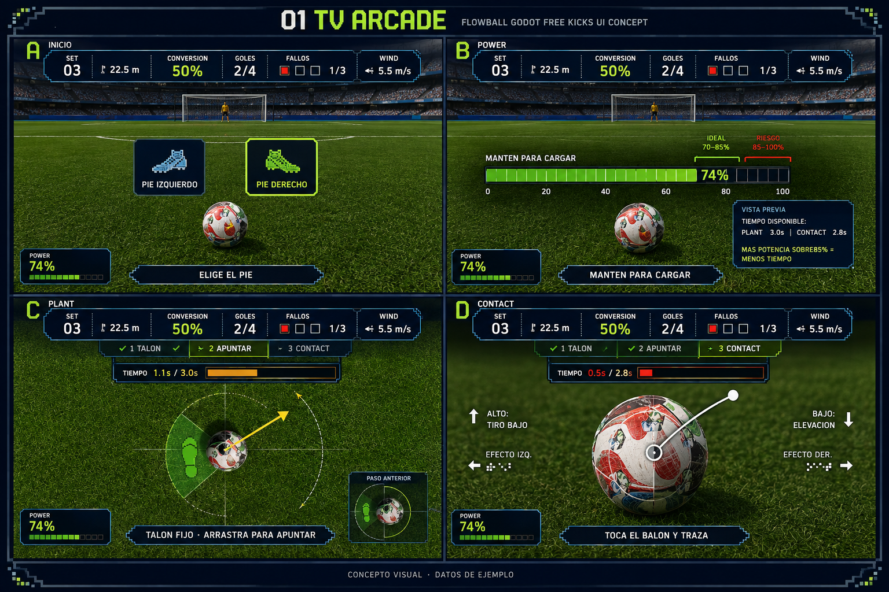
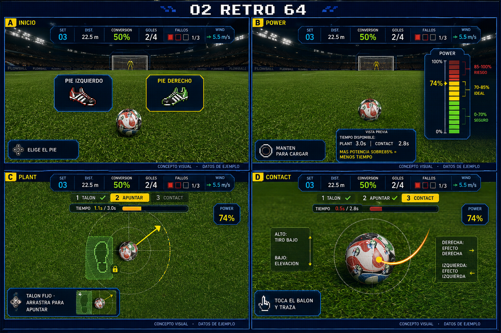
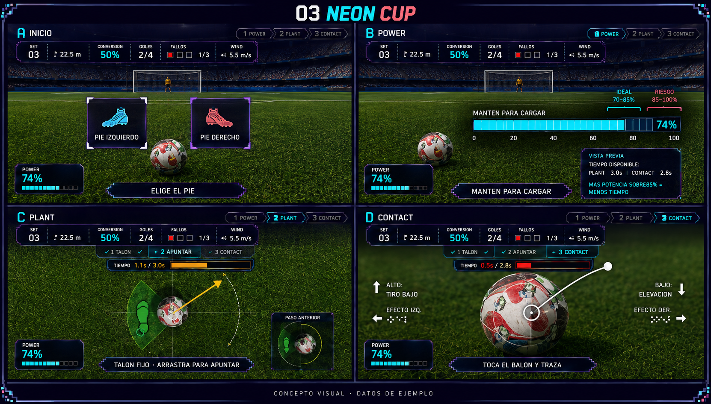
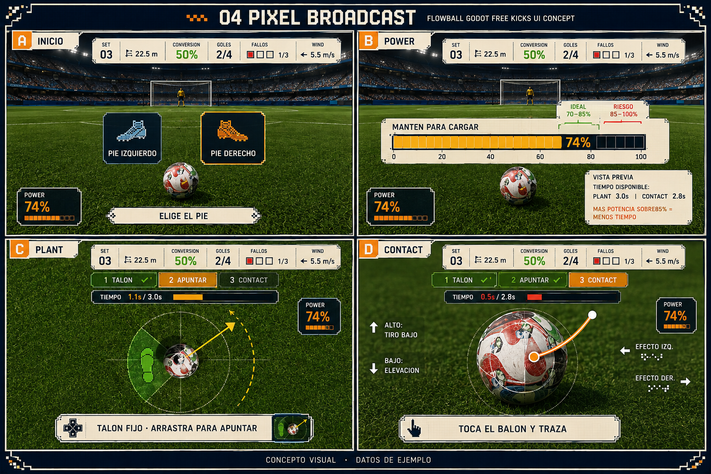

# Full-flow concepts

Generated using built-in image_gen. Four boards, four screens each. Reference screenshots: user Plant and Contact.

Implementation corrections: main steps must remain POWER / PLANT / CONTACT. Heel / Aim are only Plant substeps. No 74% badge in initial foot selection before charging. One power gauge only. Gauge position must match numeric value exactly. Example countdown budgets are illustrative defaults; use difficulty.step_time_budget at runtime, preserve one Plant countdown across heel and aim. No gameplay changes implemented.

## 01 TV ARCADE

Prompt:
Create a high-resolution 2x2 presentation board of FOUR coherent game screenshot UI mockups, all from ONE visual design system. Wide landscape board, each quadrant widescreen, crisp readable lettering, clear gutters. Title and label each quadrant: A INICIO, B POWER, C PLANT, D CONTACT. These are conceptual UI redesigns for Flowball Godot free kicks. Reference user image1 is exact top-down Plant camera/grass/ball reference; user image2 is close-up Contact ball reference. For INICIO and POWER use the same stadium world seen from behind a bottom-center ball looking toward distant center goal and yellow goalkeeper. Maintain 3D grass/stadium and recognizable white red green football, change HUD only; do not pixelate the entire world. All UI mixes television sports graphics with late1990s 64-bit console pixel edges/icons/numerals; readable small UI sans typography.
EVERY quadrant must contain the SAME compact persistent scoreboard: SET 03, 22.5 m, CONVERSION 50%, GOLES 2/4, FALLOS 1/3 (one marked square and two empty squares), wind arrow 5.5 m/s. NEVER omit conversion percentage. Keep scorebug small, maximum ~12% screen height. Consistent positions of scoreboard, steps, wind and instruction across all screens.
A INICIO means pre-shot foot selection, NOT a title menu: central field clear, two accessible cards PIE IZQUIERDO / PIE DERECHO, instruction ELIGE EL PIE, phase Power pending, no active countdown yet.
B POWER: PIE DERECHO selected; hold charging at74%. ONE power meter with monotonic 0–100 scale, fill74%, ideal bracket70–85% at its actual scale position, risk85–100. Instruction MANTEN PARA CARGAR. A small secondary preview reads TIEMPO DISPONIBLE: PLANT 3.0s | CONTACT 2.8s and MAS POTENCIA SOBRE85% = MENOS TIEMPO. This is preview, NOT a running countdown.
C PLANT: top-down grass with ball, green allowed heel region on LEFT of ball for right-foot kick. Show heel locked in that region with pixel footprint, yellow aiming arrow pointing up-right pivoting from heel and an aim arc. Two substep tabs 1 TALON with check and 2 APUNTAR active. Instruction TALON FIJO · ARRASTRA PARA APUNTAR. Tiny inset inside lower instructional panel shows previous substep heel placement region, not another full screen. Power locked74% in small badge. Prominent independent countdown strip below phase tabs, TIEMPO1.1s /3.0s, about37% remaining in amber. It is shared across both plant substeps and does not reset at aiming.
D CONTACT: close-up ball central-lower, generous free swipe space, subtle circle reticle, small contact dot and curved swipe trace with tail past ball, concise labels ALTO: TIRO BAJO and BAJO: ELEVACION and EFECTO by sides. Instruction TOCA EL BALON Y TRAZA. Power locked74% in same badge position. Same countdown location, TIEMPO0.5s /2.8s, ~18% remaining red with numeric text.
Completed phases checked, active highlighted, future subdued. Distinguish time bar (seconds) from power (%). No debug text, no enormous translucent panels, no shoe photograph; small pixel boot icon only. Never obscure interactions with HUD. Include small footer CONCEPTO VISUAL · DATOS DE EJEMPLO. Consistent coherent polished layouts within this board. STYLE FOR ALL FOUR QUADRANTS: Navy opaque broadcast scorebugs,ivory text,lime accents,hard shadows,subtle stepped borders,restrained sporty professional. Power horizontal lower-left. Thin prominent time strip top-center. Board title: 01 TV ARCADE

## 02 RETRO 64

Prompt:
Create a high-resolution 2x2 presentation board of FOUR coherent game screenshot UI mockups, all from ONE visual design system. Wide landscape board, each quadrant widescreen, crisp readable lettering, clear gutters. Title and label each quadrant: A INICIO, B POWER, C PLANT, D CONTACT. These are conceptual UI redesigns for Flowball Godot free kicks. Reference user image1 is exact top-down Plant camera/grass/ball reference; user image2 is close-up Contact ball reference. For INICIO and POWER use the same stadium world seen from behind a bottom-center ball looking toward distant center goal and yellow goalkeeper. Maintain 3D grass/stadium and recognizable white red green football, change HUD only; do not pixelate the entire world. All UI mixes television sports graphics with late1990s 64-bit console pixel edges/icons/numerals; readable small UI sans typography.
EVERY quadrant must contain the SAME compact persistent scoreboard: SET 03, 22.5 m, CONVERSION 50%, GOLES 2/4, FALLOS 1/3 (one marked square and two empty squares), wind arrow 5.5 m/s. NEVER omit conversion percentage. Keep scorebug small, maximum ~12% screen height. Consistent positions of scoreboard, steps, wind and instruction across all screens.
A INICIO means pre-shot foot selection, NOT a title menu: central field clear, two accessible cards PIE IZQUIERDO / PIE DERECHO, instruction ELIGE EL PIE, phase Power pending, no active countdown yet.
B POWER: PIE DERECHO selected; hold charging at74%. ONE power meter with monotonic 0–100 scale, fill74%, ideal bracket70–85% at its actual scale position, risk85–100. Instruction MANTEN PARA CARGAR. A small secondary preview reads TIEMPO DISPONIBLE: PLANT 3.0s | CONTACT 2.8s and MAS POTENCIA SOBRE85% = MENOS TIEMPO. This is preview, NOT a running countdown.
C PLANT: top-down grass with ball, green allowed heel region on LEFT of ball for right-foot kick. Show heel locked in that region with pixel footprint, yellow aiming arrow pointing up-right pivoting from heel and an aim arc. Two substep tabs 1 TALON with check and 2 APUNTAR active. Instruction TALON FIJO · ARRASTRA PARA APUNTAR. Tiny inset inside lower instructional panel shows previous substep heel placement region, not another full screen. Power locked74% in small badge. Prominent independent countdown strip below phase tabs, TIEMPO1.1s /3.0s, about37% remaining in amber. It is shared across both plant substeps and does not reset at aiming.
D CONTACT: close-up ball central-lower, generous free swipe space, subtle circle reticle, small contact dot and curved swipe trace with tail past ball, concise labels ALTO: TIRO BAJO and BAJO: ELEVACION and EFECTO by sides. Instruction TOCA EL BALON Y TRAZA. Power locked74% in same badge position. Same countdown location, TIEMPO0.5s /2.8s, ~18% remaining red with numeric text.
Completed phases checked, active highlighted, future subdued. Distinguish time bar (seconds) from power (%). No debug text, no enormous translucent panels, no shoe photograph; small pixel boot icon only. Never obscure interactions with HUD. Include small footer CONCEPTO VISUAL · DATOS DE EJEMPLO. Consistent coherent polished layouts within this board. STYLE FOR ALL FOUR QUADRANTS: Cobalt bevel block panels,yellow highlights,white pixel numerals,chunky unbranded pixel boots,navy shadows,1998 console sports identity. Compact top scoreboard; vertical power meter far-right; strong yellow active step tabs and bottom-left instruction cards. Board title: 02 RETRO 64

## 03 NEON CUP

Prompt:
Create a high-resolution 2x2 presentation board of FOUR coherent game screenshot UI mockups, all from ONE visual design system. Wide landscape board, each quadrant widescreen, crisp readable lettering, clear gutters. Title and label each quadrant: A INICIO, B POWER, C PLANT, D CONTACT. These are conceptual UI redesigns for Flowball Godot free kicks. Reference user image1 is exact top-down Plant camera/grass/ball reference; user image2 is close-up Contact ball reference. For INICIO and POWER use the same stadium world seen from behind a bottom-center ball looking toward distant center goal and yellow goalkeeper. Maintain 3D grass/stadium and recognizable white red green football, change HUD only; do not pixelate the entire world. All UI mixes television sports graphics with late1990s 64-bit console pixel edges/icons/numerals; readable small UI sans typography.
EVERY quadrant must contain the SAME compact persistent scoreboard: SET 03, 22.5 m, CONVERSION 50%, GOLES 2/4, FALLOS 1/3 (one marked square and two empty squares), wind arrow 5.5 m/s. NEVER omit conversion percentage. Keep scorebug small, maximum ~12% screen height. Consistent positions of scoreboard, steps, wind and instruction across all screens.
A INICIO means pre-shot foot selection, NOT a title menu: central field clear, two accessible cards PIE IZQUIERDO / PIE DERECHO, instruction ELIGE EL PIE, phase Power pending, no active countdown yet.
B POWER: PIE DERECHO selected; hold charging at74%. ONE power meter with monotonic 0–100 scale, fill74%, ideal bracket70–85% at its actual scale position, risk85–100. Instruction MANTEN PARA CARGAR. A small secondary preview reads TIEMPO DISPONIBLE: PLANT 3.0s | CONTACT 2.8s and MAS POTENCIA SOBRE85% = MENOS TIEMPO. This is preview, NOT a running countdown.
C PLANT: top-down grass with ball, green allowed heel region on LEFT of ball for right-foot kick. Show heel locked in that region with pixel footprint, yellow aiming arrow pointing up-right pivoting from heel and an aim arc. Two substep tabs 1 TALON with check and 2 APUNTAR active. Instruction TALON FIJO · ARRASTRA PARA APUNTAR. Tiny inset inside lower instructional panel shows previous substep heel placement region, not another full screen. Power locked74% in small badge. Prominent independent countdown strip below phase tabs, TIEMPO1.1s /3.0s, about37% remaining in amber. It is shared across both plant substeps and does not reset at aiming.
D CONTACT: close-up ball central-lower, generous free swipe space, subtle circle reticle, small contact dot and curved swipe trace with tail past ball, concise labels ALTO: TIRO BAJO and BAJO: ELEVACION and EFECTO by sides. Instruction TOCA EL BALON Y TRAZA. Power locked74% in same badge position. Same countdown location, TIEMPO0.5s /2.8s, ~18% remaining red with numeric text.
Completed phases checked, active highlighted, future subdued. Distinguish time bar (seconds) from power (%). No debug text, no enormous translucent panels, no shoe photograph; small pixel boot icon only. Never obscure interactions with HUD. Include small footer CONCEPTO VISUAL · DATOS DE EJEMPLO. Consistent coherent polished layouts within this board. STYLE FOR ALL FOUR QUADRANTS: Midnight purple,cyan and coral,subtle pixel edge glow,asymmetric compact scorebug upper-left,step track upper-right,thin timer beneath it. Horizontal power lower-right. Sleek esports arcade,large clear center and sparse chrome. Board title: 03 NEON CUP

## 04 PIXEL BROADCAST

Prompt:
Create a high-resolution 2x2 presentation board of FOUR coherent game screenshot UI mockups, all from ONE visual design system. Wide landscape board, each quadrant widescreen, crisp readable lettering, clear gutters. Title and label each quadrant: A INICIO, B POWER, C PLANT, D CONTACT. These are conceptual UI redesigns for Flowball Godot free kicks. Reference user image1 is exact top-down Plant camera/grass/ball reference; user image2 is close-up Contact ball reference. For INICIO and POWER use the same stadium world seen from behind a bottom-center ball looking toward distant center goal and yellow goalkeeper. Maintain 3D grass/stadium and recognizable white red green football, change HUD only; do not pixelate the entire world. All UI mixes television sports graphics with late1990s 64-bit console pixel edges/icons/numerals; readable small UI sans typography.
EVERY quadrant must contain the SAME compact persistent scoreboard: SET 03, 22.5 m, CONVERSION 50%, GOLES 2/4, FALLOS 1/3 (one marked square and two empty squares), wind arrow 5.5 m/s. NEVER omit conversion percentage. Keep scorebug small, maximum ~12% screen height. Consistent positions of scoreboard, steps, wind and instruction across all screens.
A INICIO means pre-shot foot selection, NOT a title menu: central field clear, two accessible cards PIE IZQUIERDO / PIE DERECHO, instruction ELIGE EL PIE, phase Power pending, no active countdown yet.
B POWER: PIE DERECHO selected; hold charging at74%. ONE power meter with monotonic 0–100 scale, fill74%, ideal bracket70–85% at its actual scale position, risk85–100. Instruction MANTEN PARA CARGAR. A small secondary preview reads TIEMPO DISPONIBLE: PLANT 3.0s | CONTACT 2.8s and MAS POTENCIA SOBRE85% = MENOS TIEMPO. This is preview, NOT a running countdown.
C PLANT: top-down grass with ball, green allowed heel region on LEFT of ball for right-foot kick. Show heel locked in that region with pixel footprint, yellow aiming arrow pointing up-right pivoting from heel and an aim arc. Two substep tabs 1 TALON with check and 2 APUNTAR active. Instruction TALON FIJO · ARRASTRA PARA APUNTAR. Tiny inset inside lower instructional panel shows previous substep heel placement region, not another full screen. Power locked74% in small badge. Prominent independent countdown strip below phase tabs, TIEMPO1.1s /3.0s, about37% remaining in amber. It is shared across both plant substeps and does not reset at aiming.
D CONTACT: close-up ball central-lower, generous free swipe space, subtle circle reticle, small contact dot and curved swipe trace with tail past ball, concise labels ALTO: TIRO BAJO and BAJO: ELEVACION and EFECTO by sides. Instruction TOCA EL BALON Y TRAZA. Power locked74% in same badge position. Same countdown location, TIEMPO0.5s /2.8s, ~18% remaining red with numeric text.
Completed phases checked, active highlighted, future subdued. Distinguish time bar (seconds) from power (%). No debug text, no enormous translucent panels, no shoe photograph; small pixel boot icon only. Never obscure interactions with HUD. Include small footer CONCEPTO VISUAL · DATOS DE EJEMPLO. Consistent coherent polished layouts within this board. STYLE FOR ALL FOUR QUADRANTS: Warm ivory panels,navy type,orange active state,emerald confirmation,crisp stepped outlines,pixel checker micro-details. Small editorial scoreboard top edge,vertical power lower-left,thin countdown top-center. Most legible restrained premium sports print meets console. Board title: 04 PIXEL BROADCAST